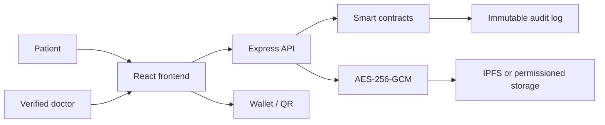

# GoldenHour architecture

The emergency path exposes only critical fields and requires a justification. A production implementation must bind provider identities to verified organizations and must perform an independent smart-contract and privacy review before handling regulated data.
